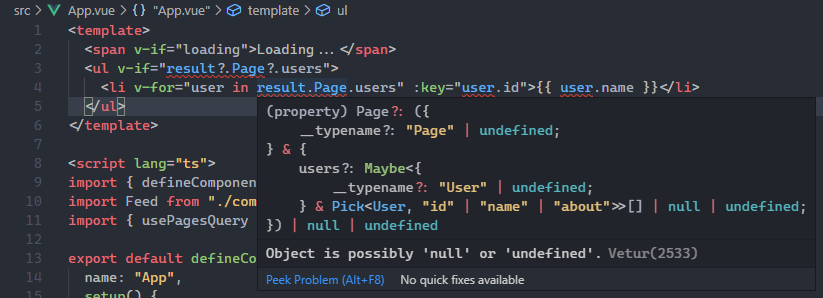

# vue3-vite-apollo-example

Example repository to demonstrate how to use `vue-apollo` with [Vite](https://github.com/vitejs/vite) & Vue 3.

# Getting Started

### Clone the repository

```
$ git clone https://github.com/Drakota/vue3-vite-apollo-example.git
```

### Rename .env.example to .env

```
$ cp .env.example .env
```

### Install dependencies

```
$ npm i
```

### Run the project

```
$ npm run dev
```

# Caveats ⚠

## GraphQL-Codegen

The project uses `graphql-codegen` for generating queries for Vue's composition API that are type-safe and outputs its content into `src/gql/index.ts`, but there doesn't seems to be a way to change how `graphql-codegen` does their imports to adapt for Vite at the moment.

```ts
// We need to manually change this in src/gql/index.ts
import * as VueApolloComposable from "@vue/apollo-composable";
import * as VueCompositionApi from "@vue/composition-api";
// To this because we are using Vite
import VueApolloComposable from "@vue/apollo-composable";
import VueCompositionApi from "@vue/composition-api";
```

## Vetur Interpolation

While using [Vetur's template interpolation service](https://vuejs.github.io/vetur/interpolation.html), we can also see that the type of the `usePagesQuery`'s result isn't properly getting inferred when checking for null value before iterating over.


